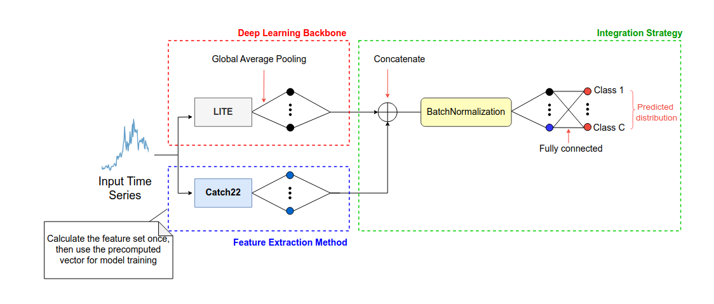

# COCALITE: A Hybrid Model COmbining CAtch22 and LITE for Time Series Classification

This is the source code of our paper "[COCALITE: A Hybrid Model COmbining CAtch22 and LITE for Time Series Classification](https://doi.org/10.1109/BigData62323.2024.10825872)" [[pdf](https://germain-forestier.info/publis/bigdata2024.pdf)] accepted in the [2024 IEEE International Conference on Big Data (BigData)](https://www3.cs.stonybrook.edu/~ieeebigdata2024/) This work was done by [Oumaima Badi](https://www.linkedin.com/in/oumaima-badi-837060237/), [Maxime Devanne](https://maxime-devanne.com/), [Ali Ismail-Fawaz](https://hadifawaz1999.github.io/), [Javidan Abdullayev](https://az.linkedin.com/in/cavidan-abdullayev-83289815b), [Vincent Lemaire](https://fr.linkedin.com/in/vincentlemaire), [Stefano Berretti](https://www.micc.unifi.it/berretti/), [Jonathan Weber](https://www.jonathan-weber.eu/) and [Germain Forestier](https://germain-forestier.info/).

## Abstract

Time series classification has achieved significant advancements through deep learning models; however, these models often suffer from high complexity and computational costs. To address these challenges while maintaining effectiveness, we introduce COCALITE, an innovative hybrid model that combines the efficient LITE model with an augmented version incorporating Catch22 features during training. COCALITE operates with only 4.7% of the parameters of the state-of-the-art Inception model, significantly reducing computational overhead. By integrating these complementary approaches, COCALITE leverages both effective feature engineering and deep learning techniques to enhance classification accuracy. Our extensive evaluation across 128 datasets from the UCR archive demonstrates that COCALITE achieves competitive performance, offering a compelling solution for resource-constrained environments.

## COCALITE Architecture

<p align="center" width="50%">

</p>

## Project Overview

The objective of this project is to enhance performance and maintain computational efficiency by integrating engineered feature vectors with features learned from deep learning models. The project explores various methodologies, and evaluates the impact of these strategies on time series classification tasks.

## Requirements

Please refer to the `requirements.txt` file and install the required packages using:

```bash
pip install -r requirements.txt
```

## Configuration

The project requires a YAML configuration file named `config.yaml`, which includes the following parameters:

- `datasets`: List of dataset names to process.
- `dataset_repo`: Path to the dataset repository.
- `results_directory`: Directory to save results.
- `features_directory`: Directory for feature files.
- `models_directory`: Directory for model files.
- `pretrained_models_directory`: Directory for pre-trained models.
- `approach`: Approach to use (options: `"concatenation"`, `"finetuning"`, `"from_scratch"`).
- `task`: Task to perform (options: `"training"`, `"evaluation"`, `"concatenate_features"`).
- `tiny_lite`: Boolean indicating if using the tiny version of the model.
- `use_catch22`: Boolean indicating if using Catch22 features.
- `use_ensemble`: Boolean indicating if using ensemble methods.

Ensure that the `config.yaml` file is properly configured to suit your needs. This file directs the script on which datasets to use, their locations, and the approach and tasks to perform.

## Usage

To start processing datasets according to the specified configuration, execute the main script:

```bash
python main.py
```
## Approach Descriptions
### Concatenation
**Purpose** This approach combines features from different sources to create a unified feature set.

#### Task: concatenate_features

Combines features from the specified datasets using pre-trained models along with pre-computed Catch22 features. It trains and evaluates models based on the value of use_ensemble, which determines whether to ensemble the five models or compute the mean accuracy across models.

### Fine-Tuning
**Purpose**: This approach fine-tunes pre-trained models by concatenating Catch22 features with the latent space of the model and then resuming training.

#### Tasks:

training: Trains the models on the specified datasets.<br>
evaluation: Evaluates the performance of fine-tuned models on the datasets.

### From Scratch
**Purpose** This approach involves training models from scratch, without utilizing pre-trained weight, starting with initial model parameters.

#### Tasks:

training: Trains models from scratch using the specified datasets.<br>
evaluation: Evaluates the performance of models trained from scratch on the datasets.

## Contributing
Contributions are welcome! Please submit issues, pull requests, or suggestions. Ensure that contributions align with the project's goals.

## ACKNOWLEDGMENT

This work was supported by the ANR DELEGATION project (grant ANR-21-CE23-0014) of the French Agence Nationale de la Recherche. The authors would like to acknowledge the High Performance Computing Center of the University of Strasbourg for supporting this work by providing scientific support and access to computing resources. Part of the computing resources were funded by the Equipex Equip@Meso project (Programme Investissements d’Avenir) and the CPER Alsacalcul/Big Data. The authors would also like to thank the creators and providers of the UCR Archive.
